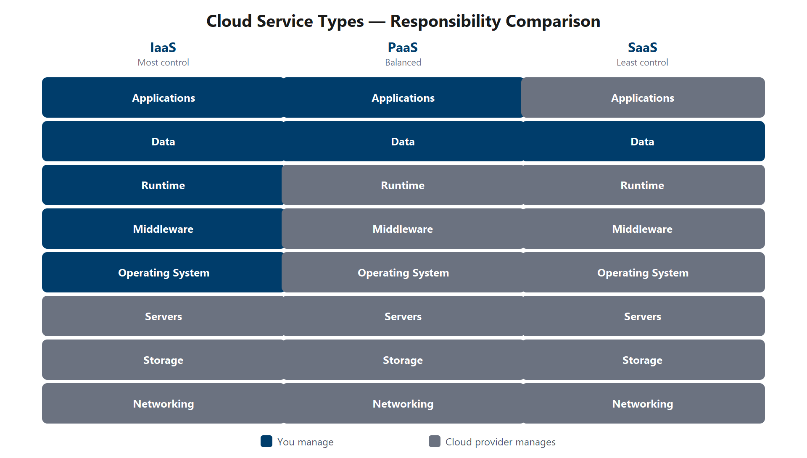

# Introduction to Cloud Infrastructure: Describe Cloud Concepts

## Module 1: Intro to Cloud

### i. Shared Responsibility Model

With the shared responsibility model, responsibilities get shared between the cloud provider and the consumer. Physical security, power, cooling, and network connectivity are the responsibility of the cloud provider. The consumer isn't collocated with the datacenter, so it wouldn't make sense for the consumer to have any of those responsibilities.

At the same time, the consumer is responsible for the data and information stored in the cloud. (You wouldn't want the cloud provider to be able to read your information.) The consumer is also responsible for access security, meaning you only give access to those who need it.

### ii. Cloud Models

- **Private:** It's a cloud (delivering IT services over the internet) that's used by a single entity. Private cloud provides much greater control for the company and its IT department.

- **Public:** A public cloud is built, controlled, and maintained by a third-party cloud provider. (general public availability).

- **Hybrid:** A hybrid cloud environment can be used to allow a private cloud to surge for increased, temporary demand by deploying public cloud resources. Hybrid cloud can be used to provide an extra layer of security. For example, users can flexibly choose which services to keep in public cloud and which to deploy to their private cloud infrastructure.

### iii. Consumption-Based Model

2 types of expenses → **Capital Expenditure (CapEx)** and **Operational Expenditure (OpEx)**.

- **CapEx** is typically a one-time, up-front expenditure to purchase or secure tangible resources.
- **OpEx** is spending money on services or products over time.

---

## Module 2: Benefits of Using Cloud

### i. High Availability and Scalability

#### High availability

When you're deploying an application, a service, or any IT resources, it's important the resources are available when needed. High availability focuses on ensuring maximum availability, regardless of disruptions or events that may occur.

When you're architecting your solution, you need to account for service availability guarantees. These guarantees are part of the service-level agreements (SLAs). Each service has their own SLAs.

#### Scalability

- Adjust resources to match the demand.

The other benefit of scalability is that you aren't overpaying for services. Because the cloud (public) is a consumption-based model, you only pay for what you use. If demand drops off, you can reduce your resources and thereby reduce your costs.

2 varieties of scaling : vertical and horizontal

- vertical : add more CPU/RAM. (increasing or decreasing the capabilities of resources)
- horizontal : add more VMs. (adding or subtracting the number of resources)

### ii. reliability and predictability in the cloud

#### Reliability

ability of a system to recover from failures and continue to function. With a decentralized design, the cloud enables you to have resources deployed in regions around the world.

#### Predictability

Predictability is the ability to forecast the performance and cost of a system. Move forward with confidence.

- Performance predictability focuses on predicting the resources needed to deliver a positive experience for your customers. Autoscaling, load balancing, and high availability are just some of the cloud concepts that support performance predictability.

- Cost predictability is focused on predicting or forecasting the cost of the cloud spend. With the cloud, you can track your resource use in real time, monitor resources to ensure that you’re using them in the most efficient way, and apply data analytics to find patterns and trends that help better plan resource deployments.

### iii. Security and Governance

On the security side, you can find a cloud solution that matches your security needs. If you want maximum control of security, infrastructure as a service provides you with physical resources but lets you manage the operating systems and installed software, including patches and maintenance. If you want patches and maintenance taken care of automatically, platform as a service or software as a service deployments may be the best cloud strategies for you.

### iv. manageability in the cloud

#### Management of the Cloud

How the cloud manages your resources.

- Automatically scale resource deployment based on need.
- Deploy resources based on a preconfigured template, removing the need for manual configuration.
- Monitor the health of resources and automatically replace failing resources.
- Receive automatic alerts based on configured metrics, so you're aware of performance in real time.

#### Management in the Cloud

How you manage your resources in the cloud.

- Through a web portal.
- Using a command line interface.
- Using APIs.
- Using PowerShell.

### v. Sustainability-aligned cloud practices

- Scaling resources down when demand decreases
- Turning off or deallocating resources that are not in use
- Choosing efficient services and configurations to reduce overprovisioning
- Using governance and monitoring to track usage trends and optimize deployments over time.

## Module 3: Cloud Service Types

cloud service type determines the flexibility you have with managing and configuring resources.

### i. Infrastructure as a Service (IaaS)

most flexible category of cloud services. With IaaS, you're essentially renting the hardware in a cloud datacenter, but what you do with that hardware is up to you.

Scenarios : 

- Lift-and-shift migration: You set up cloud resources similar to your on-premises datacenter, and then move your workloads to the IaaS infrastructure.
- Testing and development: You need to rapidly replicate established configurations for development and test environments.

### ii. Platform as a Service (PaaS)

You focus on your application code, data, and access controls. You build on the Platform.

Scenarios :

- Development framework: PaaS provides a framework that developers can build upon to develop or customize cloud-based applications. Developers can create applications using built-in software components.

- Analytics or business intelligence: Tools provided as a service with PaaS allow teams to analyze and mine their data, find insights and patterns, and predict outcomes to improve planning and operational decisions.

### iii. Software as a Service (SaaS)

most complete cloud service model from a product perspective. you're essentially renting or using a fully developed application. Email, financial software, messaging applications, and connectivity software are all common examples of a SaaS implementation.

You primarily manage your data, identity and access settings, and device access posture.