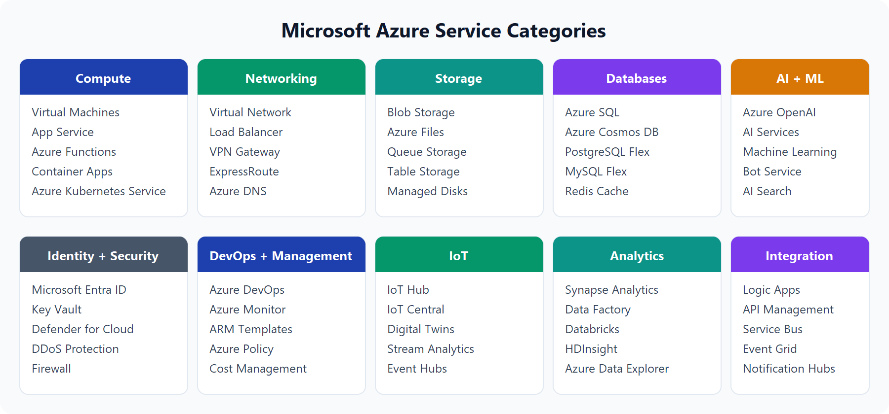

# Introduction to Cloud Infrastructure: Describe Azure architecture and services

## Module 1: Core Components of Azure Architecture

Scope Level : Account -> Subscription -> Resource Group -> Resources

Subscriptions separate billing and access control for resources. A subscription can contain multiple resource groups, which in turn can contain multiple resources.
Every resource in Azure is associated with a specific resource group and subscription. Resource groups provide a way to manage and organize resources based on their lifecycle, permissions, and policies.

two main groupings: the physical infrastructure and the management infrastructure.

### i. Azure Physical Infrastructure

Data Centers, Regions, Availability Zones, and Edge Zones are the physical infrastructure components of Azure.

#### Data Centers

facilities with servers arranged in racks, with dedicated power, cooling, and networking infrastructure — similar to an on-premises datacenter, but at a much larger scale.
datacenters are grouped into Azure Regions and Azure Availability Zones that provide resiliency and reliability for your workloads.

